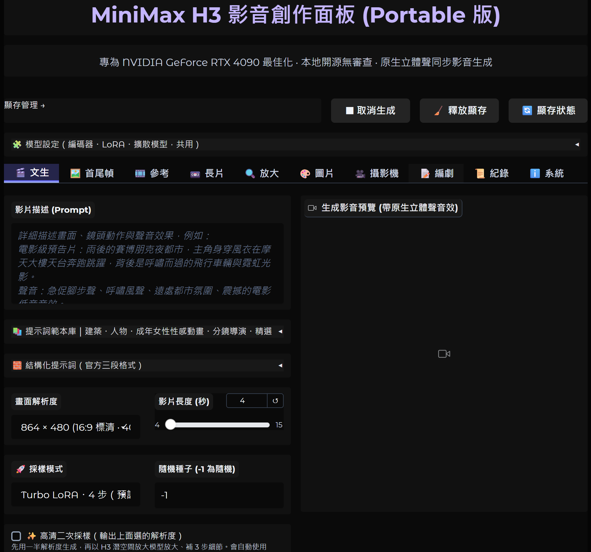
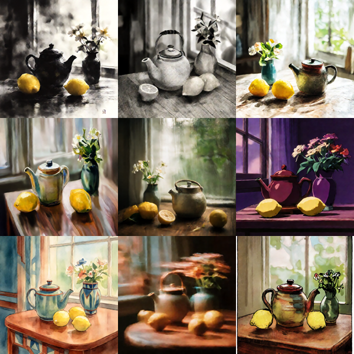

# MiniMax H3 Portable 影音創作面板

**繁體中文** | [English](README.en.md) | [简体中文](README.zh-CN.md) | [日本語](README.ja.md)

在一張 **12～32 GB 顯存**的 NVIDIA 顯卡上，用 [MiniMax H3](https://huggingface.co/MiniMaxAI/MiniMax-H3) 開源模型生成有聲影片的本機 Gradio 面板。
後端是 ComfyUI，全程在自己的電腦上推論，不使用雲端 API。開啟時會自動偵測顯存並調整設定，不用自己記參數。

**介面語言**：自動跟隨瀏覽器（中文瀏覽器顯示繁體中文，其他顯示英文），也可以按上方 🌐 按鈕切換，會記住你的選擇。

**分頁**：文生影音 · 首尾幀（FL2VA）· 參考影音（Ref2VA）· V2V · 對嘴 · SeedVR2 影片放大 · Krea2 圖片生成 ·
Qwen-Image 修圖 · 🖍️ 筆刷修圖（畫幾筆，AI 把筆畫變成真實物件）· 3D 攝影機 · 編劇分鏡 · 紀錄 ·
🌐 提示詞網站（內嵌 [ArchiPrompt](https://archi-prompt.com/)，建築／景觀／室內設計 AI 提示詞）。

**📚 提示詞範本庫**：每個生成分頁都有可瀏覽的現成提示詞，附 **Krea2 產生的縮圖**，分類有建築、人物、美食、動物、自然、產品、交通、運動、
科幻，以及 MiniMax 官方提示詞指南。建築／人物／動畫範本依 H3 **官方三段格式**撰寫（`integrated_multimodal_description` /
`overall_soundscape` / `non_diegetic_music`）。編劇分頁另有 15 個故事範本（建築、室內設計、景觀、房仲銷售、人物）。

**✨ AI 專業提示詞**：輸入一句話（中文即可），可以附一張圖，本機的 Qwen3-VL 會把它寫成 H3 官方格式，包含三段欄位、運鏡，以及
`(S1)` + `<d>[Chinese] …</d>` 台詞格式。文生、首尾幀、編劇、圖片分頁都有，免費、離線，幾秒完成。

**🧷 LoRA**：「🧩 模型設定」裡有 FL2VA 與 Ref2VA 兩個 LoRA 選單和強度滑桿，套用到所有影音分頁。

> 本 repo **只包含面板程式碼與下載腳本**，不含模型權重；安裝時由腳本從官方來源下載，並逐一核對 SHA-256。

| 文生影音（高清二次採樣） | SeedVR2 放大（前 → 後） |
| --- | --- |
|  |  |

Krea2 圖片風格 LoRA：

---

## 需要準備

- **NVIDIA 顯卡，12～32 GB 顯存。** 開啟時自動偵測顯存，跑不動的選項會自動關閉：

  | 顯存 | 建議用法 | 自動關閉 |
  | --- | --- | --- |
  | 24～32 GB（4090 / 5090 / 3090） | 全部功能，包含高清二次採樣與 Full HD | — |
  | 16 GB（4080 / 5080 / 4070 Ti S） | Q4 模型，864×480～960×544，4～10 秒 | 高清二次採樣、Full HD |
  | 12 GB（4070 / 3060 12G） | Q4 模型，864×480，4～6 秒 | 同上；SeedVR2 會多放到 CPU |

  顯存較小時，先用 864×480 生成，再到「🔍 放大」分頁用 SeedVR2 升解析度。
- **系統記憶體 32 GB 以上**（12～16 GB 顯卡建議 64 GB）。
- **Windows 10（1803 以後）或 11**，磁碟約 **200 GB 可用空間**（核心模型約 38 GB，加上選用模型）。
  不需要安裝 git 或 Python：ComfyUI portable 自帶 Python，`install.bat` 用的是 Windows 內建的 `curl`／`tar`。

## 安裝：一鍵

**最省事**：下載 **[`setup.bat`](../../raw/main/setup.bat)**（右鍵 ▸ 另存連結），放進一個**空資料夾**（所在磁碟需約 200 GB），
**雙擊**它。它會下載 ComfyUI portable（固定 v0.36.0）、面板與核心 H3 模型，最後開啟面板，全程免 git、免 7-Zip。
中斷了再執行一次即可續傳。Windows SmartScreen 若跳出「無法辨識的應用程式」，按 **「其他資訊 ▸ 仍要執行」**
（這是未簽章的 `.bat`，只會下載下列檔案）。

想自己動手，或已經有 ComfyUI portable，就用下面三個步驟。

## 安裝：手動三步

**1. 取得 ComfyUI portable。** 從 [ComfyUI releases](https://github.com/comfyanonymous/ComfyUI/releases) 下載
   `ComfyUI_windows_portable_nvidia.7z`（用**最新版**即可，面板在 v0.36.0 測試），用 [7-Zip](https://www.7-zip.org/) 解壓，
   會得到一個含 `python_embeded\` 與 `ComfyUI\` 的資料夾。

**2. 加入面板。** 在本頁按 **Code ▸ Download ZIP**，解壓後把裡面**所有檔案**複製進步驟 1 的資料夾，讓 `install.bat` 和
   `python_embeded\` **放在同一層**。

**3. 雙擊 `install.bat`。** 它會安裝套件、免 git 下載 custom node 與核心 H3 模型（核對 SHA-256），完成後詢問是否開啟面板。
   之後平常雙擊 **`run_webui.bat`**，打開 http://127.0.0.1:7860 即可。`install.bat` 可續傳，中斷了再執行一次。

**選用模型**：雙擊 **`download_extras.bat`**，輸入數字：
1 Krea2 圖片模型（🎨 分頁，約 19 GB）· 2 Krea2 風格 LoRA · 3 Qwen-Image-2.1（🖌️ 修圖分頁，約 17 GB）·
4 SeedVR2（🔍 放大分頁，約 7 GB）· 5 高清二次採樣放大模型（24 GB 顯卡）· 6 Heretic 文字編碼器 ·
7 ✨ AI 專業提示詞（約 5 GB；選 1 或 3 時已包含）。
缺模型的分頁會直接告訴你要選哪個數字。

**🔞 成人向社群模型（18 歲以上，自行下載）**：安裝程式不會下載。10Eros-Max 與 DaSiWa 去哪裡下載、放在哪個資料夾、
怎麼在面板選用，請看 **[NSFW_MODELS.md](NSFW_MODELS.md)**。

各分頁的詳細說明：[RTX4090_LOCAL.md](RTX4090_LOCAL.md)。

## 常用批次檔

| 檔案 | 作用 |
| --- | --- |
| `run_webui.bat` | 啟動或開啟面板 |
| `restart_webui.bat` | 重啟面板與後端（有任務在跑時會拒絕） |
| `cancel_generation.bat` | 取消目前與排隊中的生成 |
| `free_vram.bat` | 卸載模型、釋放顯存 |
| `download_extras.bat` | 選用模型下載選單 |

顯存偵測錯誤時，可以先在命令提示字元執行 `set H3_VRAM_GB=16`，再執行 `run_webui.bat`，強制使用較小的設定。

## 授權與使用須知

- 面板程式碼：MIT，見 `LICENSE`。
- **模型各有自己的授權**，安裝前請自行閱讀。MiniMax H3 採 MiniMax H3 Community License（適用範圍不含歐盟、英國、韓國與美國）；
  custom node 大多是 GPL-3.0 或 Apache-2.0。本 repo 不含也不散布任何模型權重。
- 這是本機、開源、未加內容過濾的工具，請合法使用。**請勿以真人肖像製作性感、裸露或不實影像。** 成人內容只用虛構角色，
  或取得當事人同意的素材。未經同意製作或散布他人的合成影像，在許多地方是違法的。
- custom node 與模型皆為第三方作品，其正確性、安全性與維護由原作者負責。

## 致謝

這個面板只是把以下作者的成果串在一起，衷心感謝每一位模型與程式的提供者。請到原始頁面支持他們、幫 repo 加星，並遵守各自的授權。

### 模型提供者

| 模型 | 用途 | 作者 · 出處 |
| --- | --- | --- |
| MiniMax H3（FL2VA / Ref2VA、VAE、Turbo LoRA） | 所有影音分頁 | MiniMax — [MiniMaxAI/MiniMax-H3](https://huggingface.co/MiniMaxAI/MiniMax-H3) · ComfyUI 打包：Comfy-Org [Comfy-Org/MiniMax-H3](https://huggingface.co/Comfy-Org/MiniMax-H3) |
| MiniMax H3 Q4_K_M GGUF | 預設擴散模型 | leejet — [leejet/MiniMax-H3-GGUF](https://huggingface.co/leejet/MiniMax-H3-GGUF) |
| Qwen3-VL-32B NVFP4 文字編碼器 / INT8 視訊 VAE | 文字編碼、省顯存解碼 | Qwen 團隊（阿里巴巴）· Comfy-Org — [Comfy-Org/MiniMax-H3](https://huggingface.co/Comfy-Org/MiniMax-H3) |
| Qwen3-VL-32B Heretic（無審查）編碼器 | 選用 | sakamakismile — [Qwen3-VL-32B-Heretic-MiniMax-H3-NVFP4](https://huggingface.co/sakamakismile/Qwen3-VL-32B-Heretic-MiniMax-H3-NVFP4) |
| H3 latent upscaler 3D | 高清二次採樣 | LBH-123-AI — [Minimax_h3_latent_Upscaler](https://huggingface.co/LBH-123-AI/Minimax_h3_latent_Upscaler) |
| SeedVR2 3B + EMA VAE | 🔍 影片放大 | ByteDance Seed — [ByteDance-Seed/SeedVR](https://github.com/ByteDance-Seed/SeedVR) · ComfyUI 權重：numz [numz/SeedVR2_comfyUI](https://huggingface.co/numz/SeedVR2_comfyUI) |
| Krea 2 Turbo + 風格 LoRA | 🎨 圖片分頁、範本縮圖 | Krea — ComfyUI 打包：Comfy-Org [Comfy-Org/Krea-2](https://huggingface.co/Comfy-Org/Krea-2) |
| Qwen-Image-2.1 + Qwen3-VL 8B | 🖌️ 修圖 | Qwen 團隊 — [Qwen/Qwen-Image-2.1](https://huggingface.co/Qwen/Qwen-Image-2.1) · [Comfy-Org/Qwen-Image-2.1](https://huggingface.co/Comfy-Org/Qwen-Image-2.1) · 選用 GGUF：[AlperKTS](https://huggingface.co/AlperKTS/Qwen-Image-2.1-GGUF)、[abenzerps](https://huggingface.co/abenzerps/Qwen-Image-2.1-GGUF) |
| Qwen3-VL 4B / 8B | ✨ AI 專業提示詞 | Qwen 團隊 — 經由 [Comfy-Org/Krea-2](https://huggingface.co/Comfy-Org/Krea-2) 與 [Comfy-Org/Qwen-Image-2.1](https://huggingface.co/Comfy-Org/Qwen-Image-2.1) |

### 程式提供者

| 專案 | 用途 | 作者 · 出處 |
| --- | --- | --- |
| ComfyUI（含原生 MiniMax H3、Qwen-Image 與 TextGenerate 節點） | 後端引擎 | comfyanonymous & Comfy-Org — [comfyanonymous/ComfyUI](https://github.com/comfyanonymous/ComfyUI) |
| ComfyUI-GGUF-Loader | 載入 Q4 GGUF 模型 | ChrisColeTech — [ChrisColeTech/ComfyUI-GGUF-Loader](https://github.com/ChrisColeTech/ComfyUI-GGUF-Loader) |
| ComfyUI-MiniMaxH3-TimelineDirector | 對嘴音軌鎖定 | Songssx — [Songssx/ComfyUI-MiniMaxH3-TimelineDirector](https://github.com/Songssx/ComfyUI-MiniMaxH3-TimelineDirector) |
| Comfyui_Minimax_h3_latent_Upscaler | 高清二次採樣節點 | LBH-123-AI — [LBH-123-AI/Comfyui_Minimax_h3_latent_Upscaler](https://github.com/LBH-123-AI/Comfyui_Minimax_h3_latent_Upscaler) |
| 3D Camera Control for H3 | 🎥 攝影機分頁 | NyckM — [NyckM/3d-Camera-control-H3-Minimax](https://github.com/NyckM/3d-Camera-control-H3-Minimax) |
| ComfyUI-MiniMax-H3-Edit | 攝影機提示詞編碼 | ethanfel — [ethanfel/ComfyUI-MiniMax-H3-Edit](https://github.com/ethanfel/ComfyUI-MiniMax-H3-Edit) |
| ComfyUI-SeedVR2_VideoUpscaler | 🔍 放大節點 | numz — [numz/ComfyUI-SeedVR2_VideoUpscaler](https://github.com/numz/ComfyUI-SeedVR2_VideoUpscaler) |
| h3-prompt-writing skill | 官方提示詞格式、範本庫中的指南 | MiniMax — [MiniMax-AI/MiniMax-H3](https://github.com/MiniMax-AI/MiniMax-H3) |
| Gradio | 網頁介面 | Hugging Face — [gradio-app/gradio](https://github.com/gradio-app/gradio) |
| FFmpeg（經由 imageio-ffmpeg） | 影片剪接 | [FFmpeg](https://ffmpeg.org/) · [imageio/imageio-ffmpeg](https://github.com/imageio/imageio-ffmpeg) |
| 7-Zip（7zr.exe） | `setup.bat` 解壓 ComfyUI portable | Igor Pavlov — [7-zip.org](https://www.7-zip.org/) |

✨ AI 專業提示詞的構想來自青橙Lab 的教學影片
[MiniMax H3 专业自动提示词](https://www.youtube.com/watch?v=Crp5GtXdqEA)。
